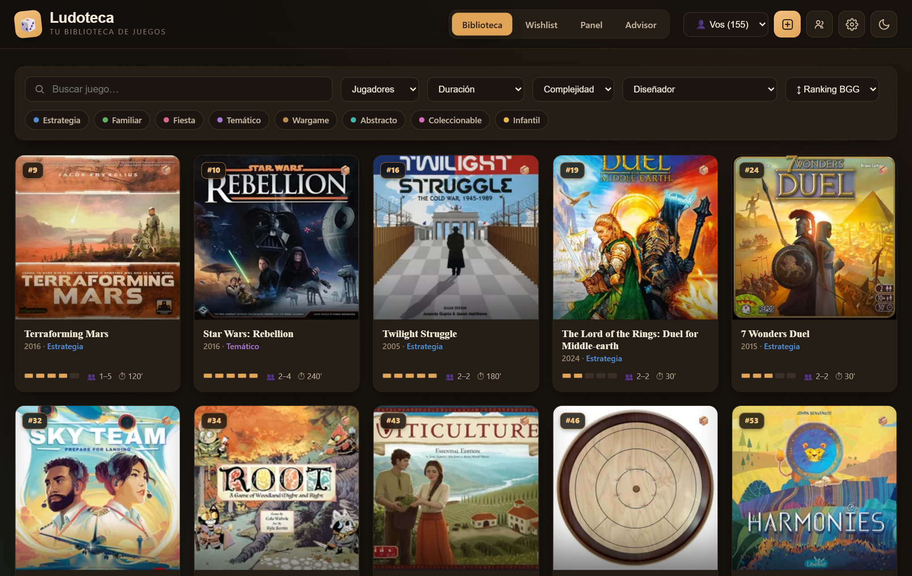
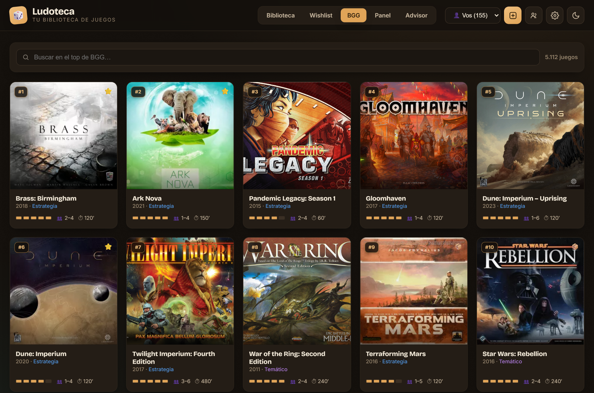
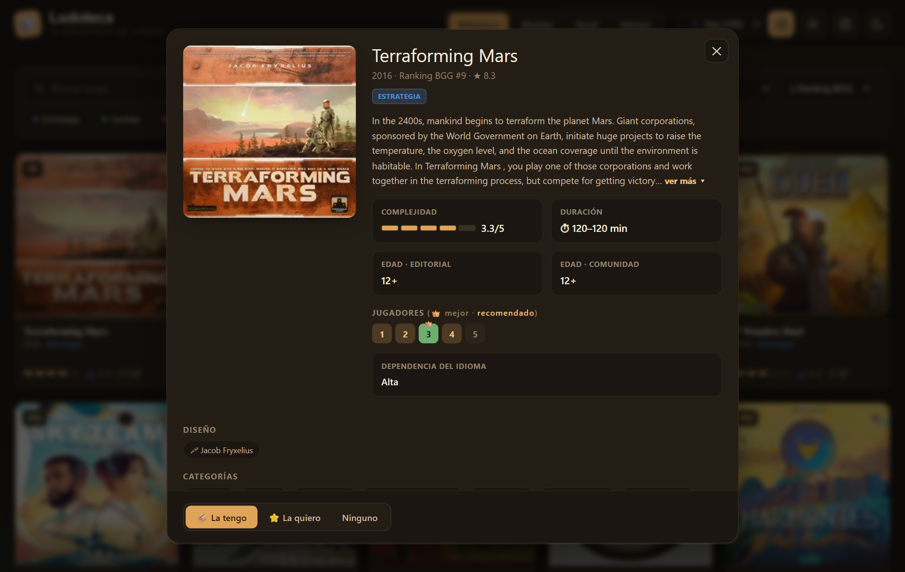
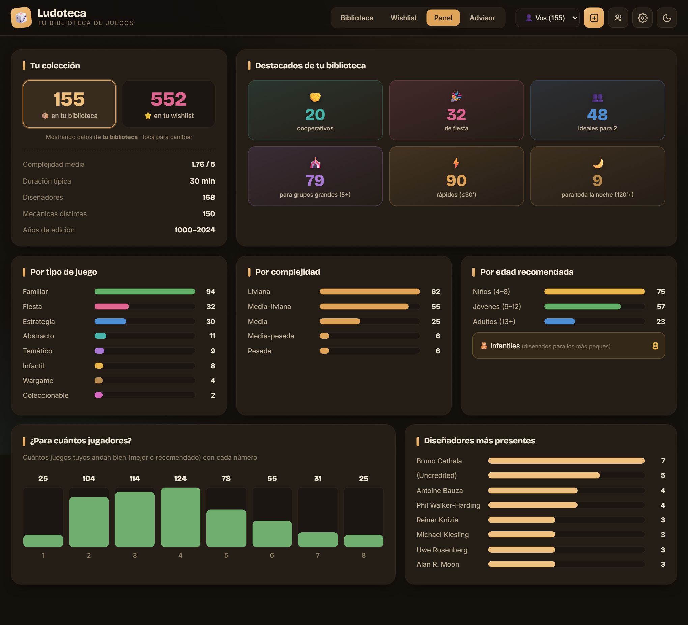
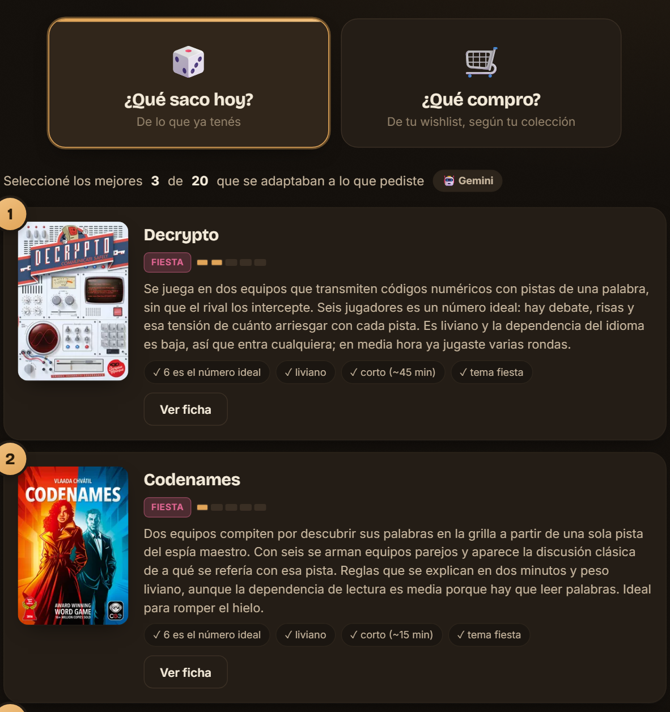

<div align="center">

# 🎲 Ludoteca

**Tu biblioteca de juegos de mesa** — navegá tu colección con datos y portadas de BoardGameGeek,<br>
mirá estadísticas, y dejá que un advisor te diga *qué sacar a la mesa hoy* o *qué te conviene comprar*.

<p>
  
  
  
  
  
  
  
</p>



<sub><a href="#qué-hace">Qué hace</a> · <a href="#correr">Correr</a> · <a href="#advisor-con-agente-opcional">Advisor</a> · <a href="#catálogo-bgg-pre-cargado-top-5000">Catálogo BGG</a> · <a href="#de-dónde-salen-los-datos">Datos</a> · <a href="#estructura">Estructura</a></sub>

</div>

---

## ¿Qué es?

Una app web local (FastAPI + SQLite + JavaScript vanilla) para gestionar tu colección de juegos de
mesa. Importás tu colección desde BoardGameGeek y Ludoteca la enriquece con portadas, complejidad,
diseñadores, categorías, mecánicas, edades y el número de jugadores "ideal" según la comunidad.
Estética de **mesa de juego premium**, responsive, con tema claro y oscuro.

## Qué hace

- 📚 **Biblioteca y Wishlist** — grid con portadas, barra de complejidad, jugadores (con badge
  *ideal / va bien*), duración y tipo. Filtros por tipo, jugadores, duración, complejidad y
  diseñador; buscador y orden. Ficha completa con edad editorial vs. comunidad, número de jugadores
  con 👑, dependencia del idioma, diseñadores clickeables, categorías, mecánicas y descripción.
- 🤖 **Advisor** — dos modos: *¿Qué saco hoy?* (entre lo que tenés) y *¿Qué compro?* (de tu
  wishlist, mirando el balance de tu colección). Elegís una **ocasión**, respondés preguntas
  simples, y elegís motor: **determinístico** (scoring transparente, instantáneo) o **agente**
  (Gemini razona sobre 20 candidatos y escribe la recomendación). En *¿Qué saco hoy?*, si un juego
  candidato tiene **expansiones que poseés**, el agente las recibe (nombre + descripción) y puede
  sugerir usarlas —o no, p. ej. con jugadores nuevos— explicando por qué.
- 💾 **Recomendaciones guardadas** — si una recomendación te gusta, la guardás (opt-in) desde el
  botón 💾 y queda en *Advisor → Guardadas* para volver a verla o eliminarla. Se guarda el resultado
  exacto (snapshot), por perfil. La ficha que abrís desde una recomendación es de solo lectura.
- 📊 **Panel** — destacados de tu colección, distribución por tipo / complejidad / edad, cobertura
  por número de jugadores (detecta huecos) y diseñadores más presentes.
- 👥 **Perfiles** — además de la tuya, cargá las colecciones de tus amigos (crear, cambiar,
  renombrar, borrar). En cada ficha ves quién tiene el juego.
- 🔄 **Import / Export / Actualizar** — importá un CSV de BoardGameGeek *o* un backup de esta app
  (ambos formatos); exportá el estado actual; refrescá rankings cuando pasa el tiempo. Si
  re-importás a un perfil que **ya tiene juegos**, primero ves una **reconciliación**: qué se
  agrega, qué cambia de estado y qué ya no está — las bajas las confirmás una por una.
- 🏆 **BGG** — navegá el **top-5000 de BoardGameGeek** con scroll infinito, buscador y los mismos
  filtros/orden que la Biblioteca (tipo, jugadores, duración, complejidad · rank/rating/complejidad/año),
  con tus juegos marcados 📦/⭐ y alta directa a biblioteca/wishlist.
- ➕ **Agregar juego** — buscás por nombre o pegás el ID / URL de BGG y trae todos los datos solo.
  Las **expansiones** no entran como juego suelto: si buscás una, su ficha te avisa que es expansión
  y solo te deja **sumarla al juego base** que ya tenés/deseás.
- 📦 **Expansiones** — dentro de la ficha de cada juego tuyo, una sección para marcar qué
  expansiones tenés (📦) o querés (⭐), con un panel "＋" que lista las oficiales de BGG. Viven
  colgadas del juego madre (no ensucian listas ni estadísticas); en la Biblioteca podés buscar un
  juego por el nombre de una expansión que tengas.
- 🎨 **Apariencias** — tres temas elegibles (en Configurar y en el onboarding): *Clásica* (fieltro
  oscuro, con día/noche), *Playa* (teal + coral sobre marfil) y *Taberna* (navy + madera sobre crema).
- 🔒 **Modo seguro** — un candado en la barra que bloquea los cambios (agregar, estados, expansiones,
  perfiles): para que un chico navegue, filtre y use el Advisor sin tocar la colección. Se abre con
  un toque o con un PIN opcional, y arranca cerrado cada vez que abrís la app.

## Galería

<table align="center">
  <tr>
    <td width="50%"><br><sub><b>BGG</b> — navegá el top-5000 con los mismos filtros que la Biblioteca</sub></td>
    <td width="50%"><br><sub><b>Ficha</b> — edad, jugadores ideales, idioma, categorías y mecánicas</sub></td>
  </tr>
  <tr>
    <td width="50%"><br><sub><b>Panel</b> — destacados, distribución y cobertura por número de jugadores</sub></td>
    <td width="50%"><br><sub><b>Advisor</b> — qué sacar hoy o qué comprar, con recomendaciones guardadas</sub></td>
  </tr>
</table>

<details align="center">
  <summary>🔍 <b>Ver las capturas en grande</b> (sin salir de esta página)</summary>
  <br>
  <br><br>
  <br><br>
  <br><br>
  
</details>

## Correr

```bash
pip install -r requirements.txt
python server/seed.py     # una vez: crea bg.db con el catálogo top-5000 (data/bgg_top.json)
python -m uvicorn app:app --app-dir server --port 8778
```

Abrí **http://localhost:8778**. Arranca **vacío**: un onboarding te deja cargar tu colección
(export de BGG o backup de esta app) o empezar de cero agregando juegos a mano.

> **Tus datos quedan solo en tu máquina.** El repo trae únicamente el catálogo genérico del
> top-5000 (`data/bgg_top.json`). Tu colección (`bg.db`), tu export (`collection.csv`), el cache de
> tus juegos (`data/bgg_data.json`) y tu API key (`config.json`) están **gitignored**: hacés
> `git pull` para recibir mejoras del código sin que nada toque tu base ni tus cosas.

## Deploy con Docker (self-hosting)

Para correrla en un servidor (NAS, mini-PC, Raspberry) y que la familia entre desde varios
dispositivos, hay un `Dockerfile` + `docker-compose.yml`:

```bash
docker compose up -d --build
```

- El **catálogo top-5000 se siembra solo** en el primer arranque (desde `data/bgg_top.json`, sin
  bajar nada). La DB nace vacía: importás tu colección y cargás la API key desde la UI.
- La DB (`bg.db`) y la config (`config.json`, con la key) viven en un **volumen** (`ludoteca_data`),
  no en la imagen: los redeploys reconstruyen el código pero **reusan tus datos y tu key**. La key
  también se puede inyectar por `GEMINI_API_KEY`.
- Las rutas son configurables por entorno (`BG_DB_PATH` / `BG_CONFIG_PATH`); sin esas variables, la
  app usa las de siempre → correr local con `uvicorn` sigue igual.

> ⚠️ **Seguridad — la app no tiene login.** El *modo seguro* es un freno anti-toques del lado del
> cliente, no autenticación. Si publicás el puerto, cualquiera en la red puede leer/editar la
> colección y gastar tu cuota de Gemini. Exponela **solo en una LAN de confianza**, o detrás de un
> **reverse proxy con auth** (Caddy/Traefik + Authelia). Para una sola máquina, usá el mapeo
> `127.0.0.1:8778:8778` así no sale a la red.

## Advisor con agente (opcional)

El modo **agente** usa **Google Gemini** (tiene tier gratis). Conseguí una API key en
[Google AI Studio](https://aistudio.google.com/apikey) y pegala en **⚙ → Advisor**. La key se
guarda en el **llavero de credenciales del sistema** (Windows Credential Manager / macOS Keychain,
vía `keyring`), no en texto plano; si no hay keyring disponible cae a `config.json` local. Sin key,
el Advisor funciona igual en modo determinístico (el agente queda deshabilitado hasta configurarla).

## Catálogo BGG pre-cargado (top-5000)

El repo ya viene con **`data/bgg_top.json`**: el **top-5000 de BGG por ranking, pre-seedeado a agosto 2026**
(vía la API pública de [recommend.games](https://recommend.games)). Así, quien clona el repo arranca
con el catálogo cargado **sin bajar nada** — `python server/seed.py` lo mete en la base.

### Ciclo de vida de los datos

Tu base es, en todo momento, **el top-5000 canónico ∪ tu colección** (todo lo que tenés o deseás),
y nada más. Dos ideas clave:

- **El top-5000 es igual para todos a una misma fecha** — un catálogo compartido; lo único personal
  es *cuándo* actualizás. Lo tuyo (colección/wishlist) es privado y **persiste a toda actualización**.
- **La pertenencia al top es dinámica:** "está en el top" = *rank ≤ 5000 en tu base* (que el update
  reconcilia contra el ranking del día), **no** una lista congelada. El archivo del repo
  (`data/bgg_top.json`) es solo la **semilla de arranque** para no bajar nada al instalar.

**Entran** juegos por: la semilla inicial, marcarlos *tengo/quiero*, buscarlos (ID/URL de BGG),
importar un CSV, y —lo nuevo— **cualquier juego que entre al top-5000 aparece solo en el próximo
Actualizar** (se trae su ficha completa por API). **Se van** (limpieza) solo los que **caen del top
y nadie tiene ni desea**; los tuyos se quedan siempre, con su rank real.

**Actualizar** (Perfiles y datos → Actualizar) hace todo el mantenimiento en una corrida:

1. **Baja el ranking del día** (dump diario de BGG), ~10.000 juegos, con margen sobre los 5.000.
2. **Lo limpia:** el dump trae imperfecciones (mismo rank en dos juegos, ~7 filas duplicadas del
   mismo juego, ~7 huecos). Se ordena por rank (desempata por *Geek Rating*), se **deduplica** y se
   **re-enumera 1..N** → ranking contiguo, **sin repetidos ni huecos**.
3. **Reconcilia el top-5000:** da de **alta** los que entraron (trae su ficha por API), **re-rankea**
   los que ya estaban, y **da de baja** los que cayeron y nadie tiene.
4. **Aprovecha el tramo 5001–10000** del mismo dump para **poner al día el rank de tus juegos** que
   caen ahí — gratis, sin descargas extra— antes de descartar esa mitad.
5. **Pone al día la cola** (tus juegos con rank > 10.000: clásicos masivos como Monopoly o Yahtzee)
   pidiendo el rank de cada uno por id a BGG. Son un puñado, a veces cero — sin descargar el dump
   completo por unos pocos.
6. **Resuelve los nombres en español** de los juegos nuevos (los que ya estaban no se re-trabajan).

**¿Cada cuánto actualizar?** Poco. En el top-5000 entran **~300 juegos/año** (~6% de recambio), casi
todo en la franja baja (~4000-5000); el top-1000 es muy estable. Un update cada tanto alcanza. Y como
la membresía es dinámica, **nadie depende de que se publique una base nueva** para ver lo que entró.
Opcionalmente, cada tanto se sube al repo una `data/bgg_top.json` re-horneada, solo para que un
install muy viejo no tenga que traer cientos de altas en su primer Actualizar.

> **Nota para cambios de esquema:** si en el futuro se agrega un dato nuevo que la interfaz consume,
> el **top-5000 es la referencia completa** (llega íntegro por la semilla / la reconciliación), pero
> **los juegos de tu colección fuera del top pueden quedar sin ese dato** (se trajeron en su momento,
> quizás antes del campo nuevo) y se completan **por diff** en las actualizaciones. La interfaz debe
> tolerar el faltante.

## De dónde salen los datos

BoardGameGeek cerró su XML API oficial (requiere token). Ludoteca usa dos fuentes públicas:

- **Ficha del juego** — la **API JSON del frontend de BGG** (`api.geekdo.com`: `geekitems` +
  `dynamicinfo`): imágenes, links (diseñadores, categorías, mecánicas, tipo), edades y polls de la
  comunidad. Se trae una vez, al entrar el juego a la base (es data estática).
- **Ranking diario** — el dump CSV de [`beefsack/bgg-ranking-historicals`](https://github.com/beefsack/bgg-ranking-historicals)
  (`YYYY-MM-DD.csv`, ~31k juegos rankeados). Es lo único volátil (rank + rating); se baja **parcial**
  (~10k filas) en cada Actualizar — la cola de tu colección con rank > 10.000 se pone al día pidiendo
  cada juego por id, sin bajar el dump completo. La app encuentra el último dump probando la fecha de
  hoy y retrocediendo día a día si aún no se publicó (sin depender de un LLM).

## Estructura

```
server/   app.py (API)  db.py (SQLite)  bgg.py (geekdo)  advisor.py (recomendador)
          seed.py  appconfig.py  tests.py
web/      index.html  styles.css  app.js
build/    enrich.py  backfill_desc.py  preseed_top.py (top-5000 BGG)  shots.py (capturas del README)
data/     bgg_top.json (top-5000 pre-seed, versionado) · bgg_data.json (cache local, gitignored)
docs/     capturas del README
Docker    Dockerfile · docker-compose.yml · .dockerignore (self-hosting; ver "Deploy con Docker")
```

## Tests

```bash
python server/tests.py
```

Notas de arquitectura y revisión de calidad (Clean Code): [`REVIEW.md`](REVIEW.md).
Novedades por versión: [`CHANGELOG.md`](CHANGELOG.md).

## Licencia

[MIT](LICENSE) © 2026 Manuel Grandoso.
